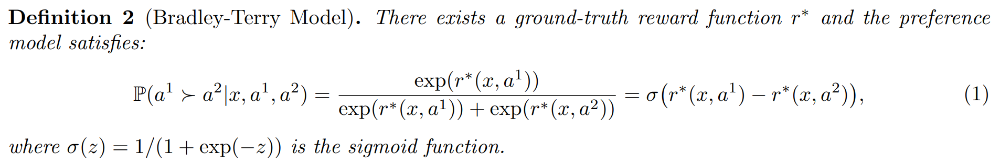

# RLHF Summary Notes
A brief and partial summary of RLHF algorithms.
This repository summarizes a list of papers and useful blogs for RLHF that are covered in my reading group presentation of a brief summary for RLHF algorithms. Please find the slides [here](Reading_Group_RLHF.pdf). 

## Why RLHF?
LLMs pre-trained on large text corpus express unintended behaviors such as hallucinations, bias/toxicity, or failure to follow instructions.
- Misaligned: language modeling objective (next token prediction) is different from the objective of human values (helpful, honest, harmless).

RLHF is proposed to align a model trained on general corpus to complex human values.
- Use human feedback for generated text as a measure of performance and use that feedback as a loss to optimize the model.
- Use methods from RL to directly optimize a language model with human feedback.

## Learning from (Human/AI) Preference Feedback

1. Preference Reward Modeling 
    - Requires building a reward model based on user preferences, optimized with RL, typically using the PPO (Proximal Policy Optimization) algorithm.
    - Computationally expensive and sensitive to hyper-parameter selection.

2. Direct Preference Optimization
    - Views preference optimization as offline RL, with implicit reward model.
    - Starting with DPO (Direct Preference Optimization), the evolution of variations of DPO aims in adjusting its loss function, with ongoing fixes that make it more RL-like and overcome existing weaknesses.

## Bradley-Terry model
Assumption of most RLHF algorithms: the preference signal can be modeled using the reward-based Bradley-Terry model.

<figure>
  
  <figcaption style="font-size: smaller; color: gray;">RLHF Workflow: From Reward Modeling to Online RLHF.</figcaption>
</figure>

* For Bradley-Terry model, the reward maximization approach is limited by the nature of “point-wise” rewards (scalar score for a single response to input x), which fails to express complex intransitive or cyclic preference relations. [[DNO](https://arxiv.org/abs/2404.03715)]

## Online RL
- [Training language models to follow instructions with human feedback.](https://arxiv.org/abs/2203.02155)
- (Summary) [RLHF Workflow: From Reward Modeling to Online RLHF.](https://arxiv.org/pdf/2405.07863v1)
- (Summary) [Secrets of RLHF in Large Language Models Part I: PPO.](https://arxiv.org/abs/2307.04964)
- (Algorithm) PPO: [Proximal Policy Optimization Algorithms.](https://arxiv.org/abs/1707.06347)
- (Algorithm) RLOO: [Back to Basics: Revisiting REINFORCE Style Optimization for Learning from Human Feedback in LLMs.](https://arxiv.org/abs/2402.14740)
- (Algorithm) GRPO: [DeepSeekMath: Pushing the Limits of Mathematical Reasoning in Open Language Models.](https://arxiv.org/pdf/2402.03300)

## Offline RL
- DPO: [Direct Preference Optimization: Your Language Model is Secretly a Reward Model.](https://arxiv.org/abs/2305.18290) 
- RPO: [Iterative Reasoning Preference Optimization.](https://arxiv.org/abs/2404.19733)
    - Additional NLL loss.
### Beyond Bradley-Terry Model
- [KTO: Model Alignment as Prospect Theoretic Optimization.](https://arxiv.org/abs/2402.01306)
- DNO: [Direct Nash Optimization: Teaching Language Models to Self-Improve with General Preferences.](https://arxiv.org/abs/2404.03715)
### Bias of Length
- R-DPO: [Disentangling Length from Quality in Direct Preference Optimization.](https://arxiv.org/abs/2403.19159) 
- [SimPO: Simple Preference Optimization with a Reference-Free Reward.](https://arxiv.org/abs/2405.14734)
### Step-wise (Process) Reward
- [Step-DPO: Step-wise Preference Optimization for Long-chain Reasoning of LLMs](https://arxiv.org/abs/2406.18629)
- [ReST-MCTS∗: LLM Self-Training via Process Reward Guided Tree Search.](https://arxiv.org/abs/2406.03816)
- [Flow-DPO: Improving LLM Mathematical Reasoning through Online Multi-Agent Learning](https://arxiv.org/abs/2410.22304) 

**Related to Process Reward Model (PRM)**
- [Let's Verify Step by Step](https://arxiv.org/abs/2305.20050)
- [Math-Shepherd: Verify and Reinforce LLMs Step-by-step without Human Annotations](https://arxiv.org/abs/2312.08935)
**Related to Monte Carlo Tree Search (MTCS)**
- [LLaMA-Berry: Pairwise Optimization for O1-like Olympiad-Level Mathematical Reasoning.](https://arxiv.org/abs/2410.02884)
- [Monte Carlo Tree Search Boosts Reasoning via Iterative Preference Learning.](https://arxiv.org/abs/2405.00451)

### Iterative DPO (Multiple Iterations)
- Self-Reward: [Self-Rewarding Language Models](https://arxiv.org/abs/2401.10020)
- SPIN: [Self-Play Fine-Tuning Converts Weak Language Models to Strong Language Models](https://arxiv.org/abs/2401.01335)
- [Building Math Agents with Multi-Turn Iterative Preference Learning.](https://arxiv.org/abs/2409.02392)

### List Ranking: Beyond Pairwise Preference
- [RRHF: Rank Responses to Align Language Models with Human Feedback without tears.](https://arxiv.org/abs/2304.05302)
- [Preference Ranking Optimization for Human Alignment.](https://arxiv.org/abs/2306.17492)
- [LiPO: Listwise Preference Optimization through Learning-to-Rank.](https://arxiv.org/abs/2402.01878)

### Preference Data Construction
Self-training: preference siginal other than human/AI labeling for each data pair?
- [Self-Consistency Preference Optimization.](https://arxiv.org/abs/2411.04109)
- (Multi-modal) [Aligning modalities in vision large language models via preference fine-tuning.](https://arxiv.org/abs/2402.11411)
- (Multi-modal) [Enhancing Large Vision Language Models with Self-Training on Image Comprehension.](https://arxiv.org/abs/2405.19716)

## Useful Blogs
- [Policy Gradient Algorithms](https://lilianweng.github.io/posts/2018-04-08-policy-gradient/) 
- [Going Deeper Into Reinforcement Learning: Fundamentals of Policy Gradients](https://danieltakeshi.github.io/2017/03/28/going-deeper-into-reinforcement-learning-fundamentals-of-policy-gradients/)
- [Illustrating Reinforcement Learning from Human Feedback (RLHF)](https://huggingface.co/blog/rlhf)
- [Proximal Policy Optimization (PPO)](https://huggingface.co/blog/deep-rl-ppo)
- [关于LLM+RL(HF)的片面脉络梳理](https://zhuanlan.zhihu.com/p/1686790674?utm_psn=1833144248435879936) 
- [Advanced Tricks for Training Large Language Models with Proximal Policy Optimization](https://www.notion.so/eb7b2d1891f44b3a84e7396d19d39e6f?v=01bcb084210149488d730064cbabc99f) 
